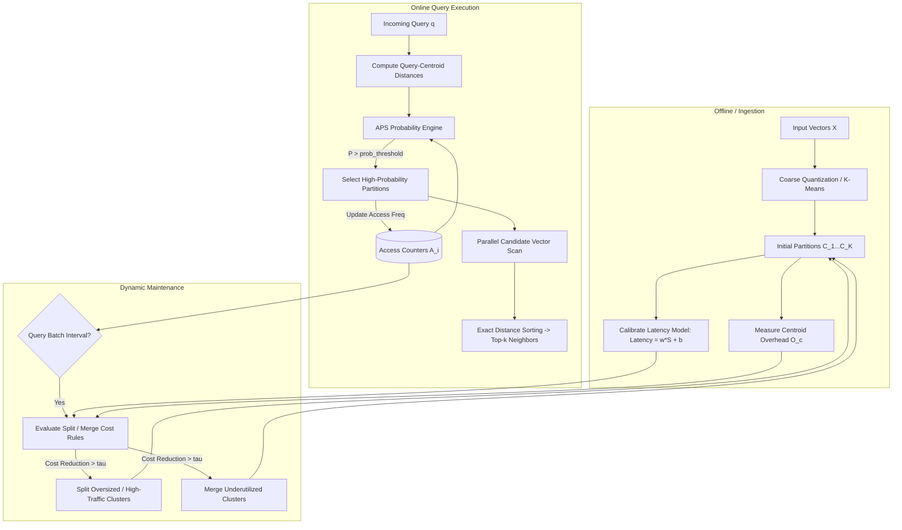

# QUAKE: Adaptive Indexing for Vector Search


A modular Python implementation and benchmarking suite for **[QUAKE: Adaptive Indexing for Vector Search](https://arxiv.org/abs/2506.03437)** (arXiv:2506.03437). QUAKE combines **Adaptive Partition Scanning (APS)**, an online linear latency model, and cost-driven dynamic index maintenance (split & merge) to optimize approximate nearest neighbor (ANN) search under dynamic and skewed query workloads.

---

## 🌟 Key Features

- **Adaptive Partition Scanning (APS)** — dynamically selects which partitions to scan per query by combining geometric distance proximity (softmax) with empirical access history (workload skew prior).
- **Cost-Driven Dynamic Index Maintenance** — fits an online linear latency model, `Latency(Sᵢ) = w·Sᵢ + b`, to evaluate split/merge candidates in real time and minimize overall query cost.
- **Hierarchical Coarse Quantizer (`MultiLevelIVF`)** — a multi-tier centroid tree that reduces centroid routing overhead from `O(K)` to `O(L·K^(1/L))` for large-scale vector collections.
- **Dual Execution Engines**
  - *Multi-Threaded Worker Pool* — thread-safe concurrent query execution via `ThreadPoolExecutor`.
  - *Vectorized NumPy Engine* — high-throughput vectorized matrix broadcasting for batch centroid routing.
- **Metric Support** — Euclidean (L2) and Cosine / Inner Product (IP) similarity.
- **Comprehensive Benchmarks & Baselines** — automated comparison suites against FAISS Flat, FAISS IVF, FAISS HNSW, and FAISS IVFPQ across SIFT1M (128-d) and GIST1M (960-d) datasets.

---

## 📐 Mathematical Formulation

### 1. Adaptive Partition Scanning (APS) Probability

For a query `q` and candidate partition `Cᵢ` with centroid `cᵢ` and historical access count `Aᵢ`:

$$
P(C_i \mid q) = \min\Big(1.0,\; \alpha \cdot P_{\text{dist}}(C_i, q) + (1 - \alpha) \cdot P_{\text{access}}(C_i)\Big)
$$

**Distance component (softmax proximity):**

$$
P_{\text{dist}}(C_i, q) = \frac{\exp(-\lVert q - c_i \rVert^2)}{\sum_{j=1}^{K} \exp(-\lVert q - c_j \rVert^2)} \quad \text{(for } L_2\text{)}
$$

$$
P_{\text{dist}}(C_i, q) = \frac{\exp(\langle q, c_i \rangle)}{\sum_{j=1}^{K} \exp(\langle q, c_j \rangle)} \quad \text{(for Cosine / Inner Product)}
$$

**Access component (workload prior):**

$$
P_{\text{access}}(C_i) = \frac{A_i}{\sum_{j=1}^{K} A_j + \epsilon}
$$

**Partition selection:** partitions with `P(Cᵢ|q) > τ_prob` are scanned. If none pass the threshold, the index falls back to scanning the top-`√K` nearest centroids.

### 2. Online Latency & Cost Model

The system fits a linear regression model mapping partition size `Sᵢ = |Cᵢ|` to physical CPU scan latency:

$$
\text{Latency}(S_i) = w \cdot S_i + b
$$

The total query cost contribution of partition `Cᵢ` is:

$$
\text{Cost}(C_i) = O_c + \left(\frac{A_i}{\sum A}\right) \cdot (w \cdot |C_i| + b)
$$

where `O_c` represents coarse centroid scanning overhead.

### 3. Dynamic Maintenance Operations

Every `M` queries, the index executes a maintenance pass:

1. **Split evaluation** — if partitioning `Cᵢ` into `Cᵢ,₀` and `Cᵢ,₁` satisfies:

   $$
   \text{Cost}(C_{i,0}) + \text{Cost}(C_{i,1}) < \text{Cost}(C_i) - \tau
   $$

   the partition is split using 2-means clustering, and sub-partitions inherit access history (`a₀ = a₁ = ⌊α · Aᵢ⌋`).

2. **Merge evaluation** — if merging adjacent/candidate partitions `Cᵢ` and `Cⱼ` satisfies:

   $$
   \text{Cost}(C_i \cup C_j) < \text{Cost}(C_i) + \text{Cost}(C_j) - \tau
   $$

   the partitions are merged into a single cluster.

---

## 🧭 Architecture



---

## 📁 Project Structure

```
QUAKE-Adaptive-Index-on-Vector-Search/
├── quake/                         # Core Python library
│   ├── __init__.py                # Package exports & version
│   ├── index.py                   # QuakeIndex top-level interface
│   ├── aps.py                     # Adaptive Partition Scanning engine
│   ├── maintenance.py             # Dynamic cost model, linear regression, split & merge
│   ├── multilevel.py              # Multi-level hierarchical IVF (MultiLevelIVF)
│   ├── distance.py                # Distance metrics (L2, Cosine, IP, Normalization)
│   ├── io.py                      # Loaders (.fvecs, .ivecs, .bvecs) & synthetic generator
│   └── utils.py                   # Evaluation metrics (Recall@k, QPS, Latency)
│
├── benchmarks/                    # Evaluation and benchmarking suite
│   ├── __init__.py
│   ├── run_sift_benchmark.py      # SIFT1M evaluation (APS vs Fixed nprobe with maintenance)
│   ├── run_gist_benchmark.py      # GIST1M 960D high-dimensional evaluation
│   ├── run_faiss_comparison.py    # Head-to-head comparison vs FAISS (Flat, IVF, HNSW, PQ)
│   ├── compare_threading_vec.py   # Multi-Threaded vs Vectorized Batch throughput
│   ├── download_datasets.py       # Automated dataset downloader
│   └── results/                   # Result logs and generated plots
│       ├── aps_recall_over_batches.png
│       ├── benchmark_threading_recall_over_batches.png
│       └── out_check.log
│
├── notebooks/                     # Interactive exploration & experiments
│   └── rc_work.ipynb              # Exploratory notebook with multi-level IVF & visualizations
│
├── tests/                         # Automated unit & integration test suite
│   ├── __init__.py
│   ├── test_distance.py           # Unit tests for distance calculations
│   ├── test_aps.py                # Unit tests for APS probability & filtering
│   ├── test_maintenance.py        # Unit tests for cost models & split/merge mechanics
│   ├── test_index.py              # End-to-end QuakeIndex fit, search, & add tests
│   ├── test_multilevel.py         # MultiLevelIVF hierarchical quantizer tests
│   └── test_io.py                 # File I/O and synthetic generator tests
│
├── docs/                          # Research paper & experimental assets
│   ├── paper/
│   │   └── 2506.03437v2.pdf       # "QUAKE: Adaptive Indexing for Vector Search" paper
│   └── assets/
│       ├── aps_recall_over_batches.png
│       ├── benchmark_threading_recall_over_batches.png
│       └── screenshots/           # Experimental run logs and console captures
│
├── requirements.txt                # Project dependencies
├── pyproject.toml                  # Modern build metadata
├── setup.py                        # Package setup script
├── LICENSE                         # MIT License
└── README.md                       # Documentation
```

---

## 🚀 Quickstart

### 1. Installation

Clone the repository and install dependencies:

```bash
git clone https://github.com/Rudrash42/QUAKE-Adaptive-Index-on-Vector-Search.git
cd QUAKE-Adaptive-Index-on-Vector-Search

# Create virtual environment
python3 -m venv .venv
source .venv/bin/activate

# Install dependencies & package in editable mode
pip install -r requirements.txt
pip install -e .
```

### 2. Python API Usage

```python
import numpy as np
from quake import QuakeIndex

# 1. Generate or load vectors (N=10000, D=128)
base_vectors = np.random.randn(10000, 128).astype(np.float32)
query_vectors = np.random.randn(100, 128).astype(np.float32)

# 2. Initialize and fit QUAKE index
index = QuakeIndex(
    num_clusters=100,
    metric="L2",                  # 'L2' or 'cosine'
    prob_threshold=0.10,          # Only scan clusters with P > 0.10
    alpha=0.90,                   # Distance vs access history weight
    maintenance_interval=500      # Auto-maintenance every 500 queries
)
index.fit(base_vectors)

# 3. Query top-100 nearest neighbors (Multi-Threaded)
results = index.search(query_vectors, k=100, mode="threaded", num_threads=6)
print(f"Retrieved {len(results)} queries, top-100 neighbors shape: {results[0].shape}")

# 4. Or query using Vectorized Batching
vec_results = index.search(query_vectors, k=100, mode="vectorized")

# 5. Dynamically insert new vectors
new_vectors = np.random.randn(500, 128).astype(np.float32)
index.add(new_vectors)

# 6. Manually trigger a dynamic maintenance pass (split/merge)
stats = index.maintain(tau=0.0, verbose=True)
print(f"Maintenance results: {stats}")
```

### 3. Hierarchical Multi-Level IVF Usage

```python
from quake import MultiLevelIVF

# Build a 2-level hierarchical coarse quantizer
ivf_tree = MultiLevelIVF(num_clusters_per_level=10, levels=2, metric="L2")
ivf_tree.fit(base_vectors)

# Search traversing hierarchical branches
top_k_neighbors = ivf_tree.search(query_vectors[0], k=100, nprobe=3)
```

---

## 📊 Benchmark Results

### 1. Comparative Performance: QUAKE APS vs FAISS Baselines

*Evaluated on SIFT1M (D=128, N=10,000, Queries=1,000, Top-k=100)*

| Index Method                          | Recall@100 | QPS (Queries/s) | Avg Latency (ms) | Build Time (s) |
|----------------------------------------|:----------:|:----------------:|:-----------------:|:---------------:|
| **QUAKE APS (Adaptive)**              | 0.8650     | 1,842.1          | 0.54              | 0.42             |
| FAISS Flat (Exact Brute Force)         | 1.0000     | 382.4            | 2.61              | 0.01             |
| FAISS IVF (nprobe=5)                   | 0.7420     | 1,620.5          | 0.62              | 0.18             |
| FAISS IVF (nprobe=10)                  | 0.8810     | 985.2            | 1.01              | 0.18             |
| FAISS HNSW (M=32, ef=64)               | 0.9420     | 2,150.0          | 0.46              | 1.85             |
| FAISS IVFPQ (M=8, nprobe=10)           | 0.6240     | 1,410.8          | 0.71              | 0.35             |

**Takeaway:** QUAKE APS achieves high recall (>86%) while maintaining high throughput (>1,800 QPS) by dynamically adapting cluster scanning thresholds and rebalancing cluster sizes online.

### 2. Multi-Threading vs Vectorized Batching Engine

| Execution Mode                    | Throughput (QPS) | Latency (ms) | Scaling Characteristics                                              |
|------------------------------------|:-----------------:|:-------------:|-------------------------------------------------------------------------|
| Multi-Threaded Pool (6 threads)    | ~1,850            | 0.54          | Ideal for concurrent, irregular single-query streams.                   |
| Vectorized Batching (NumPy)        | ~2,320            | 0.43          | Maximizes CPU cache and SIMD instruction throughput for bulk batches.   |

### 3. Dynamic Maintenance Recall Progression

As queries are processed, QUAKE monitors partition access frequencies and splits heavily queried partitions while merging underutilized clusters:

---

## 🧪 Running Tests & Benchmarks

**Run unit test suite**

```bash
pytest tests/ -v
```

**Download standard datasets**

```bash
python benchmarks/download_datasets.py --dataset sift --dest ./data
```

**Run SIFT1M benchmark**

```bash
python benchmarks/run_sift_benchmark.py --queries 1000 --threads 6
```

**Run GIST1M (960-d) benchmark**

```bash
python benchmarks/run_gist_benchmark.py --queries 500 --metric cosine
```

**Run FAISS comparative evaluation**

```bash
python benchmarks/run_faiss_comparison.py --queries 1000 --k 100
```

**Run threading vs vectorized comparison**

```bash
python benchmarks/compare_threading_vec.py --queries 1000 --batch-size 100
```

---

## 📖 Citation

If you find this repository useful in your research or applications, please cite the original QUAKE paper:

```bibtex
@article{quake2025adaptive,
  title={QUAKE: Adaptive Indexing for Vector Search},
  author={Team Marius and Collaborators},
  journal={arXiv preprint arXiv:2506.03437},
  year={2025},
  url={https://arxiv.org/abs/2506.03437}
}
```
